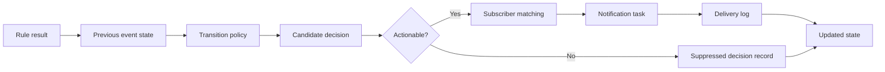

# Notification and Response Workflow

SHM-EM models notification as a traceable event-state transition rather than a
standalone email feature.

## Transition Classes

| Type | Meaning |
|---|---|
| `NEW_WARNING` | Normal to warning |
| `LEVEL_UP` | Severity increased |
| `LEVEL_DOWN` | Severity decreased |
| `RECOVERY` | Warning returned to normal |
| `SIGNIFICANT_WORSENING` | Same level with material value increase |
| `PERSISTENT_REMINDER` | Same level beyond the configured dwell time |
| `NO_STATE_CHANGE` | Recorded but intentionally not delivered |

`em_event_state_candidate_log` retains both actionable and suppressed
decisions. `em_event_state_transition` stores accepted transitions.
`em_notification_subscriber` controls scope matching, and
`em_notification_task` plus `em_notification_delivery_log` record task and
delivery state.

Email is one optional action backend. The release disables scheduled delivery
by default; enable it only after supplying SMTP settings and approved
recipients through environment variables.

